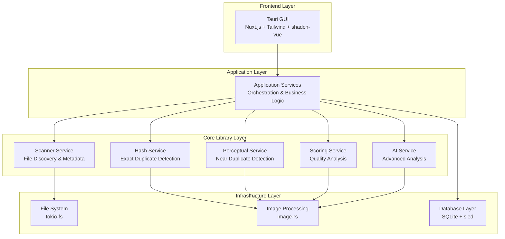

# Design Document

## Overview

CullRS (cullrs) is architected as a single Tauri desktop application with a shared core library. The system uses a modular design where the core photo processing logic is implemented in Rust libraries, with a modern Nuxt.js frontend. The architecture prioritizes performance, safety, and extensibility to support progressive feature enhancement from basic duplicate detection to advanced AI-powered analysis.

## Architecture



## Components and Interfaces

### Core Library (`cullrs-core`)

**Scanner Service**

- Responsible for recursive directory traversal and file discovery
- Filters files by supported image formats (JPEG, PNG, TIFF, RAW)
- Extracts basic metadata (size, modification time, EXIF data)
- Implements parallel processing using `rayon` for performance
- Interface: `ScannerService::scan_directory(path, options) -> Stream<ImageFile>`

**Hash Service**

- Computes cryptographic hashes (SHA-256) for exact duplicate detection
- Implements efficient file reading with memory-mapped files
- Caches hash results to avoid recomputation
- Interface: `HashService::compute_hash(file) -> Hash`

**Perceptual Service**

- Implements perceptual hashing using `img_hash` crate
- Supports multiple algorithms: dHash, pHash, aHash
- Calculates similarity scores between image hashes
- Interface: `PerceptualService::compute_perceptual_hash(image) -> PerceptualHash`

**Scoring Service**

- Analyzes technical image quality metrics
- Evaluates sharpness using Laplacian variance
- Assesses exposure and contrast using histogram analysis
- Implements composition analysis (rule of thirds, symmetry)
- Interface: `ScoringService::score_image(image) -> QualityScore`

**AI Service**

- Optional component for advanced analysis
- Integrates with ONNX Runtime for model inference
- Supports scene classification and object detection
- Implements aesthetic scoring using pre-trained models
- Interface: `AIService::analyze_image(image) -> AIAnalysis`

### Desktop GUI (`cullrs-gui`)

**Tauri Backend**

- Exposes core library functionality through Tauri commands
- Manages application state and configuration
- Handles file system operations with proper permissions
- Implements progress tracking for long-running operations

**Nuxt.js Frontend**

- Modern reactive UI using Vue 3 Composition API
- Tailwind CSS for responsive styling
- shadcn-vue components for consistent design system
- Image gallery with virtual scrolling for performance
- Drag-and-drop interface for directory selection

## Data Models

### Core Types

```rust
#[derive(Debug, Clone, Serialize, Deserialize)]
pub struct ImageFile {
    pub path: PathBuf,
    pub size: u64,
    pub modified: SystemTime,
    pub format: ImageFormat,
    pub dimensions: Option<(u32, u32)>,
    pub exif: Option<ExifData>,
}

#[derive(Debug, Clone)]
pub struct DuplicateGroup {
    pub group_id: Uuid,
    pub duplicate_type: DuplicateType,
    pub files: Vec<ImageFile>,
    pub similarity_score: Option<f64>,
}

#[derive(Debug, Clone)]
pub enum DuplicateType {
    Exact,
    NearDuplicate,
    Crop,
    Rotation,
}

#[derive(Debug, Clone)]
pub struct QualityScore {
    pub overall: f64,
    pub sharpness: f64,
    pub exposure: f64,
    pub composition: f64,
    pub technical_issues: Vec<String>,
}
```

### Configuration

```rust
#[derive(Debug, Clone, Serialize, Deserialize)]
pub struct AppConfig {
    pub similarity_threshold: f64,
    pub supported_formats: Vec<ImageFormat>,
    pub max_scan_depth: Option<usize>,
    pub parallel_workers: usize,
    pub cache_enabled: bool,
    pub ai_features_enabled: bool,
}
```

## Error Handling

The application implements comprehensive error handling using Rust's `Result` type and the `thiserror` crate for structured error types:

```rust
#[derive(Debug, thiserror::Error)]
pub enum PhotoCullingError {
    #[error("IO error: {0}")]
    Io(#[from] std::io::Error),

    #[error("Image processing error: {0}")]
    ImageProcessing(String),

    #[error("Invalid configuration: {0}")]
    Configuration(String),

    #[error("Scan interrupted by user")]
    ScanInterrupted,
}
```

Error recovery strategies:

- Graceful degradation when optional features fail
- Automatic retry for transient I/O errors
- User-friendly error messages in both GUI and CLI
- Detailed logging for debugging purposes

## Testing Strategy

### Unit Testing

- Comprehensive test coverage for core algorithms
- Mock file systems for testing without real files
- Property-based testing for hash and similarity functions
- Performance benchmarks for critical paths

### Integration Testing

- End-to-end testing with sample photo collections
- Cross-platform testing (Windows, macOS, Linux)
- Memory usage and performance testing with large datasets
- GUI automation testing using Tauri's testing framework

### Test Data

- Curated test image sets with known duplicates
- Synthetic test cases for edge conditions
- Performance test datasets of varying sizes
- Corrupted and malformed image files for robustness testing

## Database Layer

### SQLite Database

The application uses SQLite as the primary database for structured data storage and persistent caching:

**Schema Design:**

```sql
-- File metadata and scan results
CREATE TABLE scanned_files (
    id INTEGER PRIMARY KEY,
    path TEXT UNIQUE NOT NULL,
    size INTEGER NOT NULL,
    modified_time INTEGER NOT NULL,
    file_hash TEXT,
    perceptual_hash TEXT,
    quality_score REAL,
    scan_timestamp INTEGER NOT NULL,
    INDEX(file_hash),
    INDEX(perceptual_hash)
);

-- Duplicate groups and relationships
CREATE TABLE duplicate_groups (
    id INTEGER PRIMARY KEY,
    group_type TEXT NOT NULL, -- 'exact', 'near', 'crop'
    similarity_score REAL,
    created_at INTEGER NOT NULL
);

CREATE TABLE group_members (
    group_id INTEGER REFERENCES duplicate_groups(id),
    file_id INTEGER REFERENCES scanned_files(id),
    PRIMARY KEY (group_id, file_id)
);

-- User configuration and preferences
CREATE TABLE app_config (
    key TEXT PRIMARY KEY,
    value TEXT NOT NULL,
    updated_at INTEGER NOT NULL
);

-- Scan session tracking
CREATE TABLE scan_sessions (
    id INTEGER PRIMARY KEY,
    directory_path TEXT NOT NULL,
    started_at INTEGER NOT NULL,
    completed_at INTEGER,
    files_processed INTEGER DEFAULT 0,
    status TEXT NOT NULL -- 'running', 'completed', 'interrupted'
);
```

**Benefits:**

- ACID transactions for data consistency
- Complex queries for duplicate analysis and reporting
- Cross-platform compatibility
- Mature ecosystem with excellent Rust support (`rusqlite`)
- Lightweight with no external dependencies
- Efficient indexing for fast lookups

### Sled Key-Value Store

Used for high-performance caching and temporary data:

**Use Cases:**

- Image thumbnail cache (binary data)
- Temporary processing state during active scans
- Session-specific data that doesn't need long-term persistence
- High-frequency read/write operations during scanning

**Benefits:**

- Zero-copy operations for maximum performance
- Embedded with no external dependencies
- Crash-safe with automatic recovery
- Optimized for concurrent access patterns
- Minimal memory footprint

### Database Integration Strategy

**Data Flow:**

1. **Scan Phase**: Store file metadata and hashes in SQLite, cache thumbnails in Sled
2. **Analysis Phase**: Query SQLite for duplicate detection, use indexes for performance
3. **User Interaction**: Fast retrieval from SQLite with Sled cache for UI responsiveness
4. **Configuration**: Persistent user preferences in SQLite config table

**Cache Invalidation:**

- File modification time comparison to detect stale cache entries
- Automatic cleanup of orphaned records when files are moved/deleted
- Configurable cache retention policies
- Manual cache clearing options for users

**Performance Optimizations:**

- WAL mode for SQLite to improve concurrent access
- Prepared statements for frequent queries
- Batch inserts during scanning operations
- Connection pooling for multi-threaded access

## Performance Considerations

### Parallel Processing

- Use `rayon` for CPU-intensive operations
- Implement work-stealing for balanced load distribution
- Configurable thread pool sizes based on system capabilities

### Memory Management

- Stream-based processing to handle large directories
- Lazy loading of image data
- Configurable cache sizes with LRU eviction
- Memory-mapped file access for large files

### Caching Strategy

- Hash cache using `sled` embedded database
- Perceptual hash cache with TTL based on file modification time
- Configuration cache for user preferences
- Optional persistent cache across application sessions

### Optimization Targets

- Sub-second response for exact duplicate detection on 1000 images
- Near real-time preview updates in GUI
- CLI processing of 10,000+ images within reasonable time bounds
- Memory usage scaling linearly with concurrent operations, not total files
